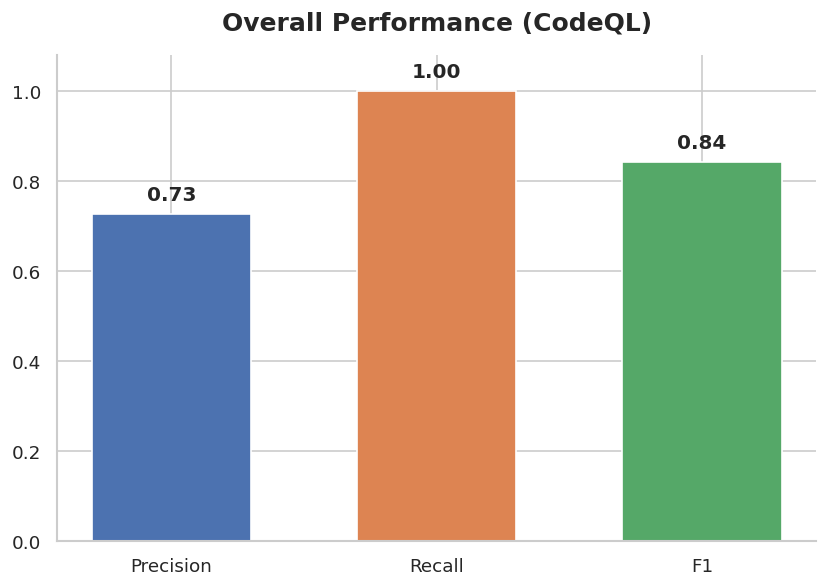
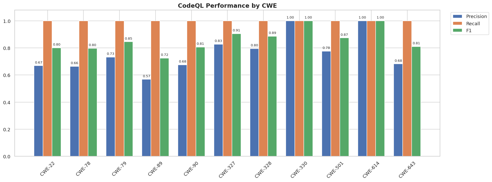
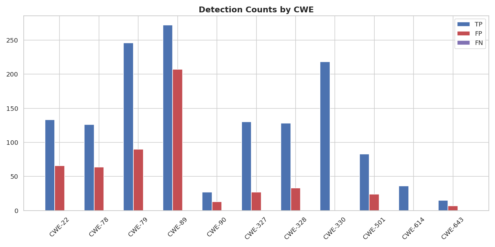

# CodeQL Evaluation Report

## Overall Performance

- **Precision:** 0.73
- **Recall:** 1.00
- **F1-score:** 0.84

CodeQL achieved a recall of **1.00**, indicating that all known vulnerabilities in the benchmark were detected.

The overall precision is **0.73**, meaning that some false positives remain.

---

## CWE-level Analysis

- **Best precision:** CWE-330, CWE-614 (1.00)
- **Lowest precision:** CWE-89 (0.57)

---

## Figures

### Overall Performance

### Performance by CWE

### Detection Counts

---

## Technical Interpretation

From the evaluation results, CodeQL demonstrates **strong vulnerability coverage** with perfect recall on this benchmark.

However, the precision score indicates that **false positives still exist**.
This is expected in static analysis tools, where conservative data-flow tracking is preferred.

In real-world auditing:

- High recall prevents missing vulnerabilities  
- Moderate precision means manual review may still be needed  

This experiment validates:

- CodeQL is suitable as a **baseline security analysis tool**
- The evaluation pipeline supports future experiments:
  - Multi-tool comparison
  - Rule improvement validation
  - Static-analysis research

---

## Reproducibility

All results are automatically generated from the evaluation pipeline:

---

## Author

**L1ngSh1**  
Generated on: 2026-02-14
